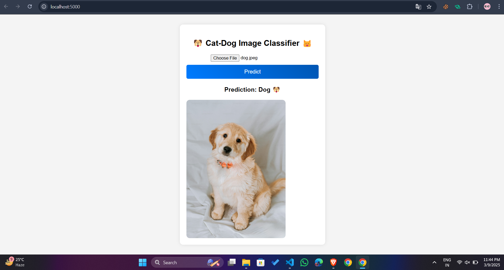

# 🐶🐱 Cat-Dog Image Classifier  

This is a **Deep Learning-based web app** that classifies **images into Cats or Dogs** using a trained **Convolutional Neural Network (CNN)** model.  

## 📌 Features  
✅ Upload an image & get **instant classification (Cat 🐱 or Dog 🐶)**  
✅ Uses a **trained CNN model (`model.pkl`)**  
✅ Built with **Flask + Node.js + TensorFlow**  
✅ Simple **Frontend (HTML, CSS, JS)**  

### 🐶🐱 Cat-Dog Classifier Web App  

