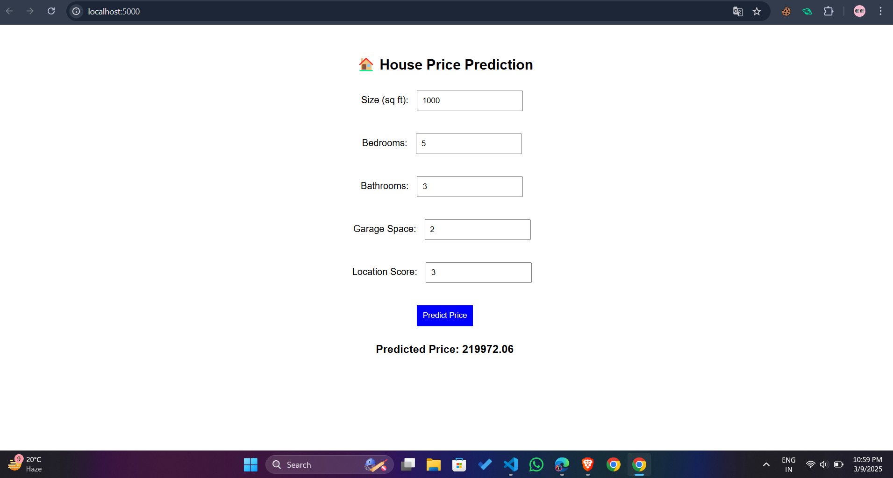

# 🏡 House Price Prediction Web App  

This is a **Machine Learning-powered web app** that predicts **house prices** based on property features like **size, bedrooms, bathrooms, garage space, and location score**.  

## 📌 Features  
✅ Predicts house prices based on input parameters  
✅ Uses a trained **ML model (`model.pkl`)**  
✅ Built with **Flask + Node.js + JavaScript**  
✅ Simple **Frontend (HTML, CSS, JS)**  

---

## 🚀 How to Run the Project  

### 1️⃣ **Clone the Repository**  
```bash
git clone https://github.com/your-username/HousePricePrediction.git
cd HousePricePrediction
 ```

### 2️⃣ Set Up Backend (Python)
Install dependencies:
pip install -r backend/requirements.txt

### Start the backend server:
node backend/server.js

### 3️⃣ Access the Web App
Open http://localhost:5000/ in your browser
Enter house details & get the predicted price


